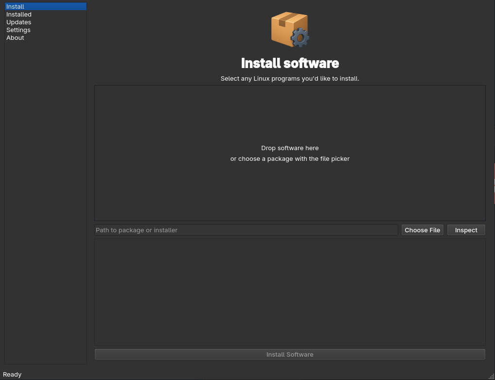

# Depot [](https://lbesson.mit-license.org/) 

`Depot` is the easiest way to install, update, sandbox, and organize Linux apps.

Drag in an app. Hit install. Depot handles the rest.

Made for Linux users who want the freedom of manual installs without the mess of scattered files, broken launchers, missing icons, unclear permissions, and random folders across the system. It was made to end the package disunification in Linux. You'll never have to worry about installing Linux software again.


**Status**
---

Depot currently supports:

- `.deb`
- `.rpm`
- `.tar.gz`
- `.flatpakref`
- `.AppImage`

**Usage**
---

Depot gives you one simple place to manage apps installed outside the normal app store flow.

You can:

- Drag and drop packages into Depot
- Install apps with desktop integration
- Update supported apps
- Sandbox apps for safer use
- Rename apps cleanly
- Manage icons
- View all Depot-managed programs in one place
- Uninstall apps without hunting through your system

**Why Depot?**
---

Linux gives users a lot of freedom, but installing apps from different formats can get messy fast.

A single app might come as a `.deb`, another as an AppImage, another as a compressed archive, another as an RPM, and another as a `.flatpakref`. Each one has its own install flow, its own quirks, its own update behavior, and its own cleanup problems.

Depot turns that into one simple workflow.

Install it. Update it. Sandbox it. Launch it. Remove it.

No terminal required.




**Requirements**

- Ruby 3.0+
- libarchive (for .tar.gz, .deb, .rpm extraction)
- bsdtar or tar
- flatpak (for .flatpakref)
- bubblewrap (optional, for sandboxing)
- git (for GUI setup)
- Qt6 development tools and headers, including qmake6 (for GUI)

**Installation**
---
For CLI:

```bash
git clone https://github.com/netizensnoopy/depot.git
cd depot
bundle install
./bin/depot --help
```

For GUI (this make take a while to compile):
```bash
git clone https://github.com/netizensnoopy/depot.git
cd depot
bundle install
./bin/setup-rubyqt6  # Fetches and builds Qt6 Ruby bindings
./bin/depot-gui
```
